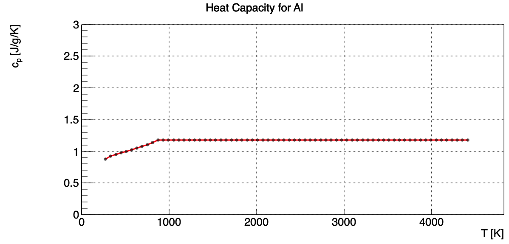
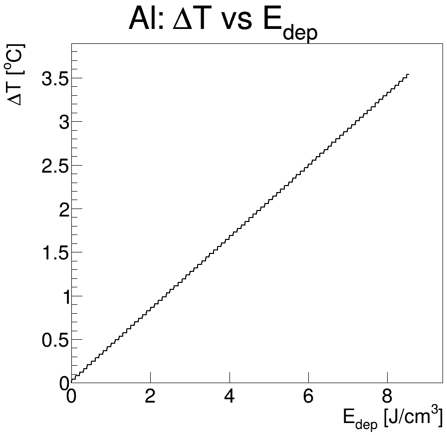
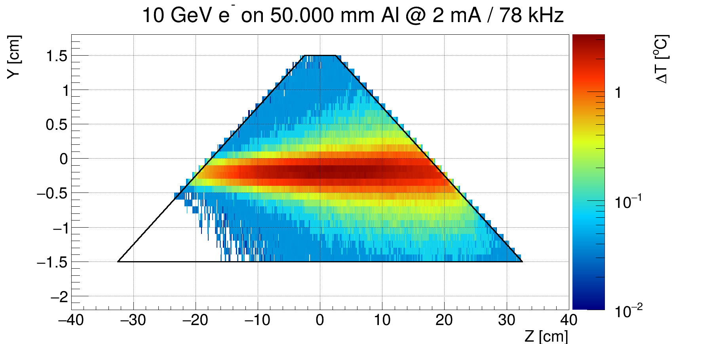
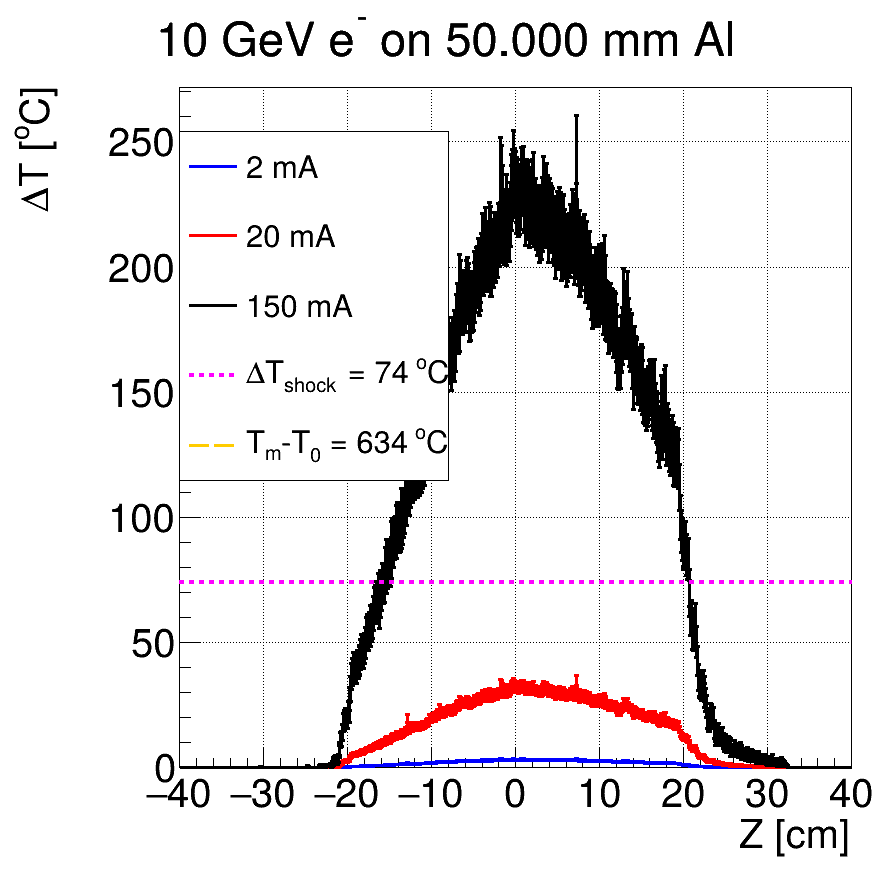
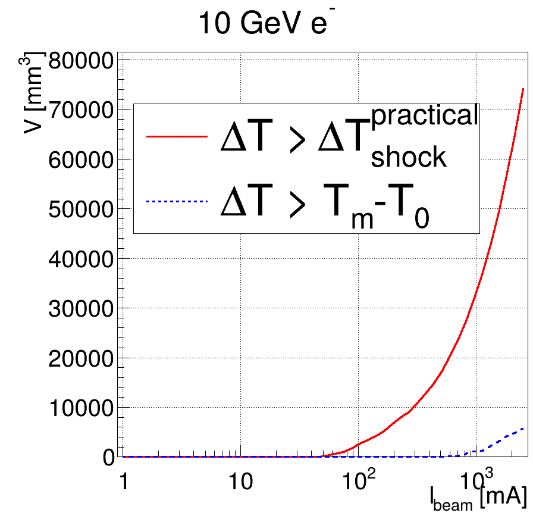
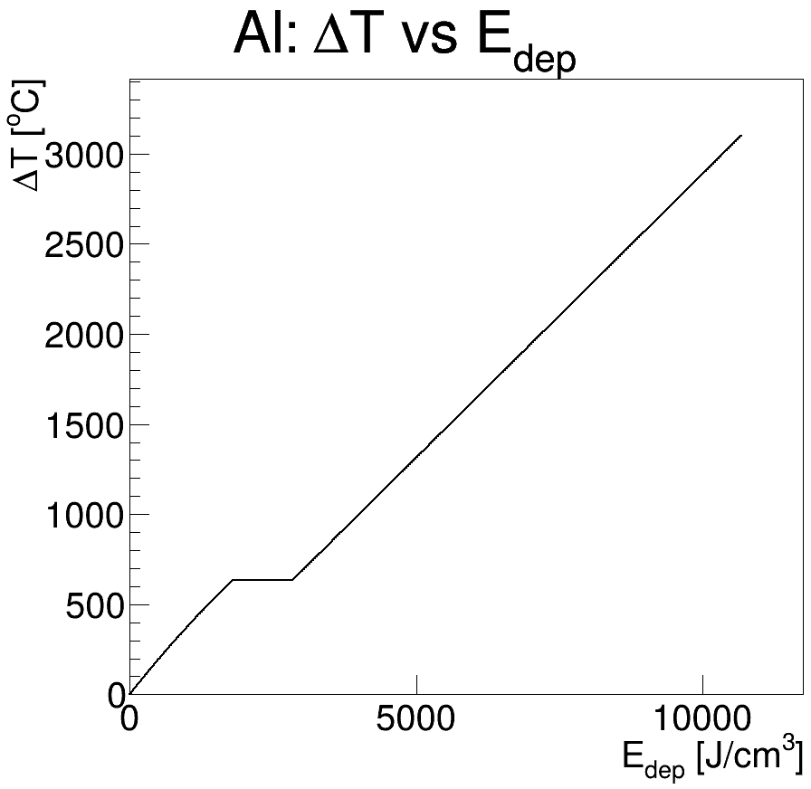

# Collimator Temperature-Rise

A minimal, self-contained **Geant4 + ROOT** example demonstrating the workflow used to evaluate the instantaneous temperature rise of an electron-beam collimator.

This repository is intended as a reproducibility companion to the collimator robustness study. It deliberately uses:

- a simple tapered collimator geometry;
- pure aluminum (`G4_Al`);
- a Gaussian electron beam;
- illustrative beam parameters;
- a 3-D Geant4 energy-deposition scoring mesh; and
- ROOT macros for converting deposited energy density into temperature rise and estimating the volume affected by thermal shock or melting.

The example is **not** a model of the final EIC ESR collimator and its numerical parameters should not be interpreted as EIC design parameters.

---

## 1. Workflow

The calculation is divided into two stages:

```text
                 GEANT4
                   │
                   ▼
        Electron transport through
        a simple tapered Al collimator
                   │
                   ▼
       3-D deposited-energy mesh
                   │
                   ▼
              edep.csv
                   │
                   ▼
             readScoring.C
                   │
                   ▼
             edep.root
                   │
                   ▼
             drawScoring.C
                   │
        ┌──────────┴──────────┐
        ▼                     ▼
  E_dep [J/cm³]          Thermal diffusion
        │                     │
        └──────────┬──────────┘
                   ▼
       ΔT(E_dep) using c_p(T)
                   │
        ┌──────────┴──────────────┐
        ▼                         ▼
   ΔT spatial maps          Beam-current scan
        │                         │
        ▼                         ▼
  maximum temperature      shock/melt volume
```

The separation is intentional: **Geant4 determines where and how much energy is deposited; the ROOT analysis converts that energy density into a thermal response.**

---

## 2. Repository contents

```text
.
├── CMakeLists.txt
├── main.cc
├── run.mac
├── vis.mac
├── include/
│   ├── DetectorConstruction.hh
│   ├── PrimaryGeneratorAction.hh
│   └── RunAction.hh
├── src/
│   ├── DetectorConstruction.cc
│   ├── PrimaryGeneratorAction.cc
│   └── RunAction.cc
└── ana/
    ├── readScoring.C
    ├── drawScoring.C
    ├── getCp.C
    ├── getDeltaTempShock.C
    ├── edep.root
    ├── *.png
    └── gr*Volume_Al.root
```

Build products are intentionally **not** included. In particular, the repository does not contain a Geant4 executable, CMake cache, object files, or machine-specific paths.

---

## 3. Requirements

The example requires:

- **Geant4** with UI/visualization support if `vis.mac` is used;
- **ROOT**;
- a C++17-capable compiler;
- **CMake ≥ 3.16**.

The source code does not depend on the absolute installation paths from the original development environment.

Check the installations with:

```bash
geant4-config --version
root-config --version
cmake --version
```

---

## 4. Build

From the repository top directory:

```bash
mkdir build
cd build
cmake ..
cmake --build . -j4
```

The executable is:

```text
build/collimator_temp_rise
```

If Geant4 cannot be found, make sure `Geant4_DIR` is visible to CMake, for example:

```bash
cmake -DGeant4_DIR=/path/to/geant4/lib/cmake/Geant4 ..
```

ROOT must also be discoverable by CMake.

---

## 5. Run the demonstration

The supplied demonstration uses:

| Parameter | Value |
|---|---:|
| Material | pure Al (`G4_Al`) |
| Electron energy | 10 GeV |
| Collimator tip length | 50 mm |
| `tan(theta)` | 0.1 |
| Beam σx | 1 mm |
| Beam σy | 1 mm |
| Number of simulated electrons | 1000 |
| Demonstration revolution frequency | 78 kHz |
| Demonstration beam currents | 2, 20, 150 mA |

Run from the `build` directory:

```bash
./collimator_temp_rise run.mac Al 50 0.1 1 1 10 output.root
```

The Geant4 run produces two files:

```text
output.root
edep.csv
```

`output.root` contains the run configuration and generated-primary information.

`edep.csv` contains the 3-D energy-deposition scoring mesh and is the input to the thermal analysis.

### Important

The beam current is **not simulated directly** in Geant4. The simulation tracks individual electrons. The ROOT analysis subsequently scales the deposited energy to a continuous beam current.

Therefore, when changing `/run/beamOn`, the `nSim` value in `ana/drawScoring.C` must also be changed to the same number of primary electrons.

---

## 6. Convert the scoring output to ROOT

Create a results directory and convert the Geant4 CSV file:

```bash
mkdir -p ../results
cd ../results
root -l -b -q '../ana/readScoring.C("../build/edep.csv","edep.root")'
```

This creates:

```text
results/edep.root
```

containing the `THnSparseF` object:

```text
h1
```

The sparse histogram stores the 3-D deposited-energy distribution on the same spatial mesh as the Geant4 scoring mesh.

---

## 7. Perform the thermal analysis

From the `results` directory:

```bash
root -l -b -q '../ana/drawScoring.C("edep.root","Al",50)'
```

The macro generates the main demonstration plots:

```text
cYZ_Al.png
c3_Al.png
c4_Al.png
c5_Al.png
c6_Al.png
grShockVolume_Al.root
grMeltVolume_Al.root
```

The analysis can take some time because the `ΔT(E_dep)` relation is calculated numerically over a fine energy-density grid.

---

## 8. Thermal model

### 8.1 Temperature-dependent heat capacity

For aluminum, the analysis uses the NIST temperature-dependent heat-capacity parameterization.

The calculation starts at:

```text
T0 = 300 K
```

For each mesh cell, the deposited energy density is converted into a temperature rise by integrating:

```text
dE = ρ c_p(T) dT
```

until the melting temperature is reached.

The aluminum parameters used in the demonstration are:

```text
ρ       = 2.70 g/cm³
Tm      = 934 K
Lf      = 1045 J/cm³
k       = 210 W/m/K
```

where `Lf` is the latent heat represented as energy per unit volume.

The resulting relationship is approximately linear at low deposited energy density and changes behavior as the melting transition is approached.

---

### 8.2 Thermal-shock criterion

The example uses a practical instantaneous temperature-rise threshold of approximately:

```text
ΔT_shock ≈ 74 K
```

based on the thermal-stress relation

```text
ΔT_shock =
    σ_ultimate (1 - ν)
    -------------------
          E α
```

using the aluminum parameters documented in `getDeltaTempShock.C`.

This criterion is intended as a **robustness threshold**, not as a complete thermo-mechanical failure model.

---

### 8.3 Thermal diffusion

The analysis includes the transverse thermal-diffusion scaling used in the original study.

The characteristic diffusion length is estimated as

```text
σ_diff = sqrt(α_th t)
```

with

```text
α_th = k / (ρ c_p)
```

and the characteristic time taken as one revolution period.

The resulting factor broadens the effective transverse energy-deposition distribution.

**This is an analysis assumption and should be clearly stated whenever the method is used quantitatively.**

---

## 9. Example results

### Heat capacity

The temperature-dependent aluminum heat capacity used by the calculation is shown below.



The heat capacity is evaluated continuously in the numerical temperature-rise calculation rather than assuming a constant `c_p`.

---

### Deposited energy → temperature rise

The first thermal conversion is the relationship between deposited energy density and instantaneous temperature rise.



This curve is used by `drawScoring.C` to convert every nonzero mesh cell from deposited energy density into temperature rise.

---

### Two-dimensional temperature distribution

The resulting temperature-rise distribution is shown in the longitudinal/transverse plane.



For this demonstration:

```text
E_e = 10 GeV
I_beam = 2 mA
f_rev = 78 kHz
```

The black outline indicates the simplified tapered collimator geometry.

---

### Maximum temperature rise along the collimator

The maximum temperature rise in each longitudinal slice is shown for several illustrative beam currents.



The horizontal reference lines indicate:

- the practical thermal-shock threshold;
- the temperature interval from the initial temperature to the aluminum melting point.

The figure demonstrates why the same Geant4 energy-deposition calculation can be rescaled to different beam currents without repeating the particle transport, provided the underlying assumptions remain valid.

---

### Volume exceeding robustness thresholds

The volume for which the temperature rise exceeds the thermal-shock or melting threshold is calculated as a function of beam current.



The curves are evaluated over a logarithmic beam-current grid.

The thermal-shock volume is generally the more relevant quantity for assessing the onset of mechanical damage before melting occurs.

---

### Extended deposited-energy range

The corresponding `ΔT(E_dep)` curve used for the beam-current threshold scan is shown below.



The curve extends beyond the range required for the low-current temperature maps so that the high-current threshold-volume calculation can be performed.

---

## 10. Interactive geometry check

The geometry and electron trajectories can be viewed interactively:

```bash
cd build
./collimator_temp_rise vis.mac Al 50 0.1 1 1 10 output.root
```

This uses the Geant4 visualization system and `vis.mac`.

The visualization is useful for checking:

- the orientation of the collimator;
- the beam position;
- the taper;
- the particle trajectories.

It is not required for the numerical thermal analysis.

---

## 11. Geometry

The demonstration collimator is a simple `G4Trd`.

Its main parameters are:

```text
L1 = user-specified tip length
H  = 30 mm
W  = 30 mm
L2 = L1 + 2 H / tan(theta)
```

The solid is rotated by 90° about X so that its tapered dimension is along the beam direction.

This geometry is intentionally generic. For an actual ESR study, the simple solid can be replaced by the detailed collimator geometry while retaining the scoring and thermal-analysis workflow.

---

## 12. Beam model

Each event contains one electron.

The electron is generated:

```text
z = -1 m
```

with transverse position sampled from Gaussian distributions:

```text
x ~ N(0, σx)
y ~ N(-2 mm, σy)
```

and travels in the `+z` direction.

The beam energy and transverse beam sizes are supplied through the command line.

The demonstration therefore models a simplified transverse Gaussian beam rather than the full machine phase-space distribution.

---

## 13. Material model

The public example uses only:

```text
Al → G4_Al
```

The original development version contained definitions for several additional materials. They have intentionally been removed from the public demonstration to keep the example focused and easy to reproduce.

The thermal analysis currently supports only aluminum:

```cpp
MaterialProps Al = { ... };
```

and:

```cpp
cp_al(T)
```

Additional materials can be implemented by providing:

1. density;
2. melting temperature;
3. latent heat;
4. thermal-shock criterion;
5. thermal conductivity; and
6. temperature-dependent heat capacity.

---

## 14. Reproducibility considerations

There are several quantities that must remain synchronized when adapting this example:

### Number of simulated electrons

`run.mac`:

```text
/run/beamOn 1000
```

must match:

```cpp
Int_t nSim = 1000;
```

in `drawScoring.C`.

### Mesh dimensions

The dimensions and binning in `run.mac` must match the arguments used by `readScoring.C`.

The default mesh is:

```text
2 cm × 2 cm × 40 cm
40 × 40 × 800 bins
```

corresponding to:

```text
0.5 mm × 0.5 mm × 0.5 mm
```

### Beam current

The beam currents in `drawScoring.C` are analysis parameters:

```cpp
Ibeam
Ibeam1
Ibeam2
```

They are not parameters of the Geant4 event generator.

### Revolution frequency

`revFreq` is also an analysis parameter and must be changed when applying the method to a different machine or beam configuration.

### Random seed

The demonstration uses a time-dependent random seed. For a statistically reproducible production calculation, explicitly record the random seed associated with each simulation.

---

## 15. What this example does — and does not — represent

### Included

- Geant4 electron transport;
- electromagnetic shower development;
- 3-D energy-deposition scoring;
- conversion to deposited-energy density;
- beam-current normalization;
- temperature-dependent aluminum heat capacity;
- melting transition;
- thermal-shock threshold;
- approximate transverse thermal diffusion;
- threshold-volume calculation.

### Not included

- detailed ESR collimator geometry;
- realistic machine lattice;
- time-dependent bunch structure;
- transient ANSYS thermo-mechanical response;
- elastic/plastic deformation;
- stress-wave propagation;
- detailed temperature-dependent thermal conductivity;
- temperature-dependent mechanical properties;
- cooling and steady-state heat transfer;
- contact resistance or mechanical mounting;
- radiation damage/material degradation.

Consequently, the example should be viewed as a **demonstration of the methodology**, not as a replacement for the detailed thermo-mechanical analysis.

---

## 16. Relation to the robustness study

The intended use of this repository is to make the computational procedure underlying the temperature-rise estimates transparent and reproducible.

The key quantity passed from Geant4 to the thermal calculation is the local deposited-energy density:

```text
E_dep [J/cm³]
```

The robustness analysis then evaluates:

```text
E_dep → ΔT
```

and compares the resulting temperature rise with material-dependent limits such as:

```text
ΔT_shock
Tm - T0
```

This makes it possible to identify where the collimator is expected to remain below the thermal-shock limit and where localized damage may occur.

---

## 17. References

The material heat-capacity data are based on the NIST Chemistry WebBook:

- Aluminum, condensed-phase thermodynamic data:
  https://webbook.nist.gov/cgi/cbook.cgi?ID=C7429905&Units=SI&Mask=2

The thermal-diffusion scaling follows the reference retained in `drawScoring.C`:

- https://inspirehep.net/files/f5414415b1051da61d51f427adb336be

The specific material and thermal-shock assumptions should be cited to the corresponding sources used in the accompanying paper.

---

## 18. Citation

If you use this package in scientific work, please cite the associated publication/preprint and the repository release URL.

```text
A. Natochii,
"Collimator Temperature-Rise Example,"
2026, https://github.com/eic/collimator-temperature-rise.
```

---

## 19. License

Coming soon ...
